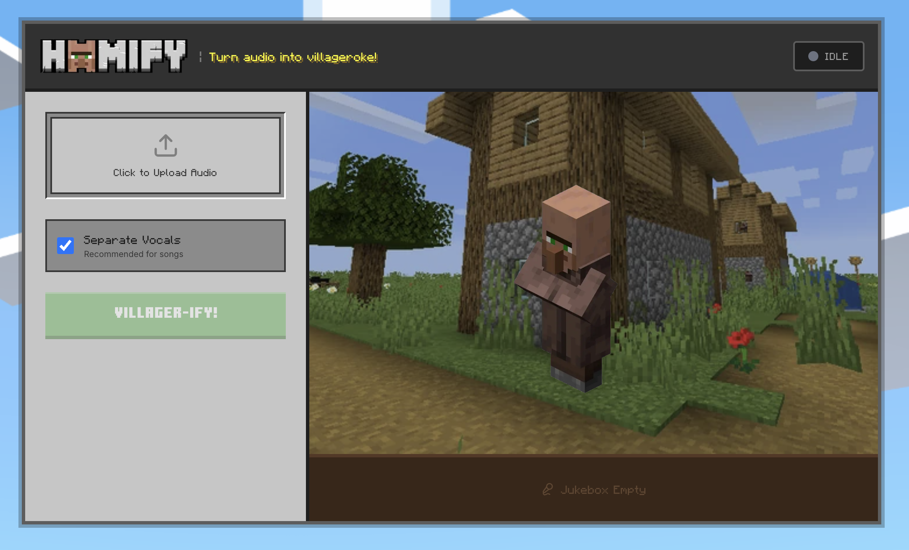

# Hmmify: AI-Powered Minecraft Villager Vocal Transformer

A fun web app that transforms any audio track into a Minecraft villager "singing" cover, complete with silly dancing animations.

## Key Features

- **AI Vocal Separation**: Utilizes the Demucs model to isolate high-fidelity vocals from background instrumentals.
- **Voice Conversion Pipeline**: Implements RVC-v2 (Retrieval-based Voice Conversion) to re-voice isolated vocals into the iconic Minecraft villager timbre.
- **Dynamic Visualizations**: Features a React-based animation system that synchronizes character movement with audio playback.
- **Intelligent Caching**: Employs a custom-built file-based caching layer to minimize redundant API calls and optimize performance.

## Tech Stack

**Frontend**  
Next.js 14, React, Tailwind CSS, Framer Motion

**Backend**  
Node.js, Next.js API Routes (Serverless)

**AI/Processing**  
Replicate API (Demucs & RVC-v2), FFmpeg

NOTE: Won't work without Replicate API Key. Currently working on fixing Vercel deployment errors.

